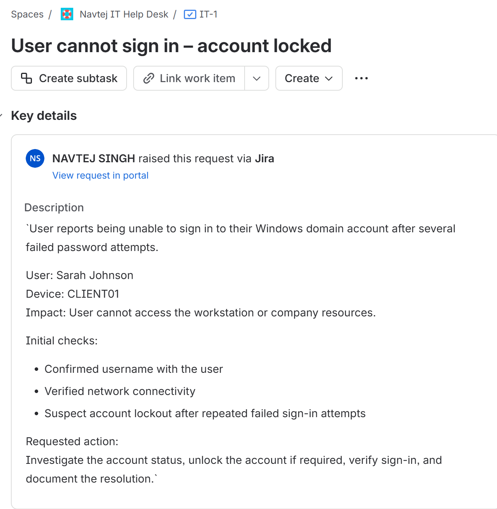
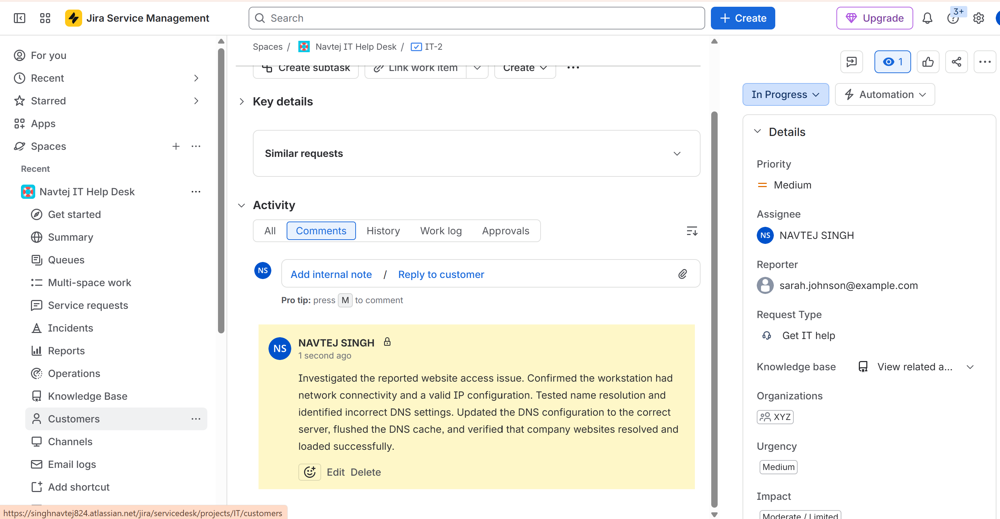
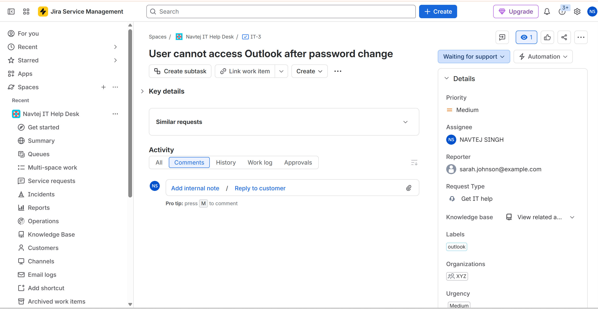
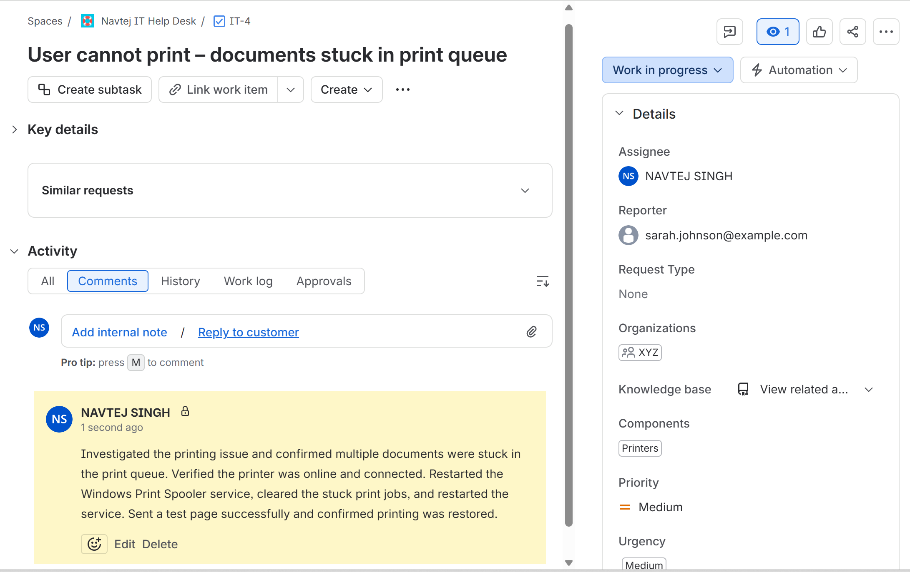
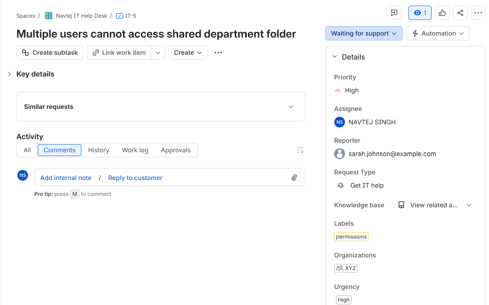
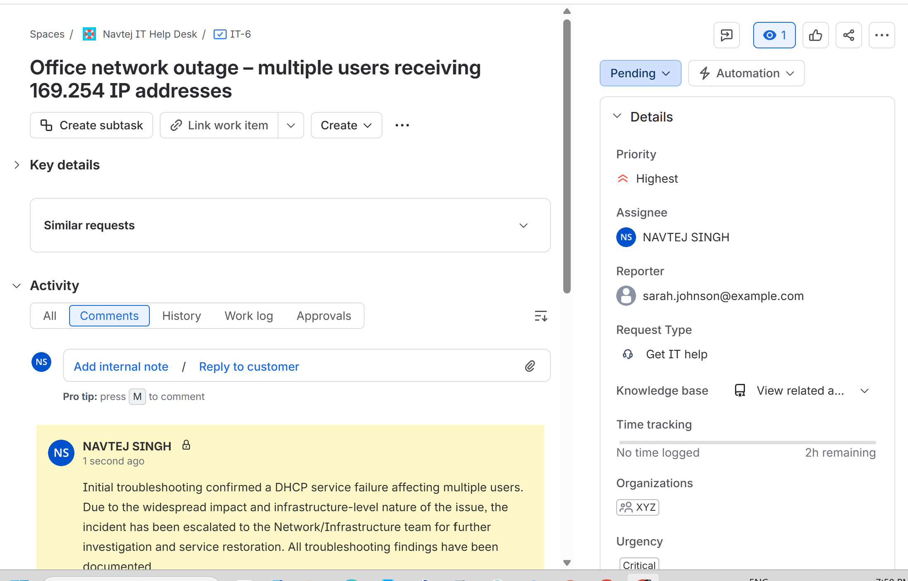

# Jira Service Management Help Desk Lab

**Jira Service Management | ITSM | Incident Management | Ticket Triage | Troubleshooting | Escalation | Documentation | Help Desk**

Hands-on Jira Service Management lab demonstrating end-to-end Help Desk ticket handling across common IT support incidents, including account lockouts, DNS issues, Outlook authentication problems, printer spooler failures, shared-folder permissions, and a critical DHCP/network outage.

---

## Project Summary

I built this Jira Service Management lab to practise common **Help Desk, IT Support, Service Desk, and Desktop Support** responsibilities in a structured ticketing environment.

In this project, I:

- Created and managed Jira Service Management support tickets
- Practised ticket intake, triage, prioritization, troubleshooting, and resolution
- Added clear internal technical notes for support-team documentation
- Worked through account lockout and authentication incidents
- Documented DNS troubleshooting and resolution
- Troubleshot Outlook access after a password change
- Investigated printer queue and Windows Print Spooler issues
- Handled a high-priority shared-folder access incident
- Reviewed shared-folder and NTFS permission problems
- Created and managed a critical DHCP/network outage incident
- Escalated a critical issue to the Network Team when appropriate
- Performed post-escalation verification before ticket closure
- Verified successful resolution before closing incidents
- Followed a consistent troubleshooting and documentation workflow

---

## Lab Environment

| Component | Configuration |
|---|---|
| Ticketing Platform | Jira Service Management |
| Support Model | Help Desk / Service Desk |
| Endpoint Environment | Windows |
| Identity Support | Active Directory account troubleshooting |
| Network Services | DNS and DHCP |
| Email Support | Microsoft Outlook |
| Printing | Windows Print Queue / Print Spooler |
| File Access | Shared folders / NTFS permissions |
| Ticket Priorities | Standard, High, Critical / Highest |
| Escalation | Network Team escalation scenario |
| Documentation | Internal notes, troubleshooting steps, verification, resolution |

---

# Selected Project Evidence

The screenshots below highlight the strongest support scenarios and ticket-management outcomes from the lab.

The complete step-by-step evidence is available in the [`screenshots`](./screenshots/) directory.

---

## 1. Account Lockout Incident

Created a Help Desk ticket for a user who could not sign in because the account was locked, documented troubleshooting, restored access, and resolved the incident.



**Skills demonstrated:** Jira Service Management, ticket creation, account troubleshooting, Active Directory support, documentation

---

## 2. DNS Troubleshooting Documentation

Investigated a DNS-related connectivity and name-resolution issue and documented the troubleshooting process in an internal Jira note before resolving the ticket.



**Skills demonstrated:** DNS troubleshooting, internal notes, network diagnostics, technical documentation

---

## 3. Outlook Password Change Support

Handled an Outlook access issue after a password change, documented the troubleshooting steps, verified access, and resolved the support ticket.



**Skills demonstrated:** Outlook support, authentication troubleshooting, ticket lifecycle management, user verification

---

## 4. Printer Queue / Spooler Troubleshooting

Investigated a user printing issue by checking the printer queue and Windows Print Spooler-related causes, documented the work, and verified successful printing.



**Skills demonstrated:** Windows printing support, Print Spooler troubleshooting, incident documentation, endpoint support

---

## 5. High-Priority Shared Folder Access Incident

Created a high-priority ticket for a user who could not access a required shared folder and documented permission-related troubleshooting.



**Skills demonstrated:** ticket prioritization, shared-folder support, NTFS permissions, access troubleshooting

---

## 6. Critical DHCP / Network Outage Escalation

Handled a critical DHCP/network outage affecting multiple users, documented troubleshooting, escalated the incident to the Network Team, verified service restoration, and resolved the ticket.



**Skills demonstrated:** critical incident handling, DHCP troubleshooting, escalation, cross-team communication, service restoration verification

---

# Help Desk Ticket Scenarios

| Scenario | Troubleshooting / Support Action | Result |
|---|---|---|
| User account locked | Reviewed the account issue, documented troubleshooting, restored access, and verified sign-in | Ticket resolved |
| DNS issue | Investigated name resolution and network symptoms and documented the fix | DNS functionality restored |
| Outlook access after password change | Reviewed password and authentication-related causes and verified Outlook access | User regained access |
| Printer queue / spooler issue | Checked printing symptoms, queue, and spooler-related causes | Printing restored |
| Shared-folder access issue | Reviewed access and permission-related causes | Required folder access restored |
| Critical DHCP/network outage | Investigated outage symptoms, documented findings, escalated to Network Team, and verified recovery | Network service restored and ticket resolved |

---

# Jira Service Management Skills

This project demonstrates practical experience with:

- Ticket creation
- Incident categorization
- Ticket prioritization
- Status management
- Internal notes
- Troubleshooting documentation
- User-impact assessment
- Technical investigation
- Resolution notes
- Ticket closure
- Escalation
- Post-escalation verification
- Professional support documentation
- End-to-end ticket lifecycle management

---

# Priority & Escalation Handling

The lab includes different incident levels to demonstrate that not every support ticket should be handled the same way.

## Standard Incidents

Routine user-impact issues included:

- Account lockout
- Outlook authentication
- Printer queue/spooler problems
- DNS troubleshooting

## High-Priority Incident

A shared-folder access problem was handled as a **High-priority** support ticket because access to required business resources can directly affect user productivity.

## Critical / Highest Incident

A DHCP/network outage affecting multiple users was treated as a **Critical / Highest-priority** incident.

The workflow included:

1. Confirming the scope and impact
2. Documenting initial troubleshooting
3. Recording findings in Jira
4. Escalating to the Network Team
5. Performing post-escalation verification
6. Confirming service restoration
7. Resolving the incident only after verification

---

# Internal Notes & Documentation

A major focus of this lab was documenting troubleshooting in a way that another technician could understand and continue the work if needed.

Internal notes included:

- Reported symptoms
- Troubleshooting performed
- Checks completed
- Technical findings
- Corrective actions
- Escalation details
- Verification results
- Final resolution

This reflects the importance of maintaining a clear technical history inside a service-management platform.

---

# Troubleshooting Method

I followed a structured troubleshooting workflow throughout the lab:

**Understand → Check → Test → Fix → Verify → Document**

## Understand

Identify the user's issue, symptoms, impact, and scope.

## Check

Review the most likely causes, configuration, services, account state, network settings, or permissions.

## Test

Reproduce or isolate the issue and confirm which component is affected.

## Fix

Apply the appropriate corrective action or escalate when the issue requires another support team.

## Verify

Confirm that the service, account, application, printer, file access, or network connection is working correctly.

## Document

Record troubleshooting, actions taken, verification, escalation, and final resolution in Jira.

---

# Ticket Lifecycle Demonstrated

```text
User Reports Issue
        ↓
Ticket Created
        ↓
Triage & Prioritization
        ↓
Troubleshooting
        ↓
Internal Documentation
        ↓
Fix or Escalation
        ↓
Verification
        ↓
Resolution
        ↓
Ticket Closed
```

---

# Complete Documentation

The screenshots displayed above are selected examples intended for recruiters and hiring managers.

The repository also contains the complete step-by-step technical evidence from the lab.

<details>
<summary><strong>📸 View All Jira Ticket Screenshots & Evidence</strong></summary>

### Account Lockout

1. [Ticket Created – Account Lockout](./screenshots/01-Jira-Ticket-Created-Account-Lockout.png)
2. [Internal Note – Account Lockout Troubleshooting](./screenshots/02-Jira-Internal-Note-Account-Lockout-Troubleshooting.png)
3. [Resolved – Account Lockout](./screenshots/03-Jira-Resolved-Account-Lockout-Ticket.png)

### DNS Troubleshooting

4. [Internal Note – DNS Troubleshooting](./screenshots/04-Jira-DNS-Troubleshooting-Internal-Note.png)
5. [Resolved – DNS Troubleshooting](./screenshots/05-Jira-Resolved-DNS-Troubleshooting-Ticket.png)

### Outlook Password Change

6. [Ticket Created – Outlook Password Change](./screenshots/06-Jira-Outlook-Password-Change-Ticket-Created.png)
7. [Internal Note – Outlook Troubleshooting](./screenshots/07-Jira-Outlook-Troubleshooting-Internal-Note.png)
8. [Resolved – Outlook Password Change](./screenshots/08-Jira-Resolved-Outlook-Password-Change-Ticket.png)

### Printer Queue / Print Spooler

9. [Ticket Created – Printer Queue Issue](./screenshots/09-Jira-Printer-Queue-Ticket-Created.png)
10. [Internal Note – Printer Spooler Troubleshooting](./screenshots/10-Jira-Printer-Spooler-Troubleshooting-Internal-Note.png)
11. [Resolved – Printer Spooler Issue](./screenshots/11-Jira-Resolved-Printer-Spooler-Ticket.png)

### High-Priority Shared Folder Access

12. [Ticket Created – High-Priority Shared Folder Access](./screenshots/12-Jira-High-Priority-Shared-Folder-Access-Ticket-Created.png)
13. [Internal Note – Shared Folder Permissions Troubleshooting](./screenshots/13-Jira-Shared-Folder-Permissions-Troubleshooting-Internal-Note.png)
14. [Resolved – Shared Folder Permissions](./screenshots/14-Jira-Resolved-Shared-Folder-Permissions-Ticket.png)

### Critical DHCP / Network Outage

15. [Ticket Created – Critical DHCP Network Outage](./screenshots/15-Jira-Critical-DHCP-Network-Outage-Ticket-Created.png)
16. [Internal Note – Critical DHCP Outage Troubleshooting](./screenshots/16-Jira-Critical-DHCP-Outage-Troubleshooting-Internal-Note.png)
17. [Escalated – DHCP Outage to Network Team](./screenshots/17-Jira-Critical-DHCP-Outage-Escalated-to-Network-Team.png)
18. [Post-Escalation Verification](./screenshots/18-Jira-DHCP-Outage-Post-Escalation-Verification.png)
19. [Resolved – Critical DHCP Network Outage](./screenshots/19-Jira-Resolved-Critical-DHCP-Network-Outage.png)

</details>

---

# Screenshot Structure

```text
screenshots/
│
├── 01-Jira-Ticket-Created-Account-Lockout.png
├── 02-Jira-Internal-Note-Account-Lockout-Troubleshooting.png
├── 03-Jira-Resolved-Account-Lockout-Ticket.png
├── 04-Jira-DNS-Troubleshooting-Internal-Note.png
├── 05-Jira-Resolved-DNS-Troubleshooting-Ticket.png
├── 06-Jira-Outlook-Password-Change-Ticket-Created.png
├── 07-Jira-Outlook-Troubleshooting-Internal-Note.png
├── 08-Jira-Resolved-Outlook-Password-Change-Ticket.png
├── 09-Jira-Printer-Queue-Ticket-Created.png
├── 10-Jira-Printer-Spooler-Troubleshooting-Internal-Note.png
├── 11-Jira-Resolved-Printer-Spooler-Ticket.png
├── 12-Jira-High-Priority-Shared-Folder-Access-Ticket-Created.png
├── 13-Jira-Shared-Folder-Permissions-Troubleshooting-Internal-Note.png
├── 14-Jira-Resolved-Shared-Folder-Permissions-Ticket.png
├── 15-Jira-Critical-DHCP-Network-Outage-Ticket-Created.png
├── 16-Jira-Critical-DHCP-Outage-Troubleshooting-Internal-Note.png
├── 17-Jira-Critical-DHCP-Outage-Escalated-to-Network-Team.png
├── 18-Jira-DHCP-Outage-Post-Escalation-Verification.png
└── 19-Jira-Resolved-Critical-DHCP-Network-Outage.png
```

---

# What I Learned

This project strengthened my understanding of how a Help Desk technician uses a ticketing platform to manage incidents from the initial user report through final resolution.

The lab reinforced that technical troubleshooting is only one part of professional IT support. A strong support workflow also requires accurate ticket prioritization, clear internal documentation, verification of the fix, and appropriate escalation when an issue falls outside the technician's scope.

The critical DHCP/network outage scenario was especially useful because it demonstrated the difference between resolving a routine single-user issue and managing a broader incident that requires escalation to another technical team.

I also practised documenting each support scenario so that another technician could understand what was checked, what was found, what action was taken, and whether the final result was verified.

---

# Skills Demonstrated

**Jira Service Management | ITSM | Help Desk Support | Service Desk | Incident Management | Ticket Triage | Ticket Prioritization | Internal Notes | Technical Documentation | Escalation | Active Directory Support | DNS | DHCP | Outlook | Windows Printing | Shared Folder Permissions | Troubleshooting | Verification**

---

# Related Projects

## Active Directory Help Desk Lab

[View Active Directory Help Desk Lab](https://github.com/Navtej8000/Active-Directory-Help-Desk-Lab)

Hands-on Windows Server and Active Directory lab covering user and group administration, Group Policy, account lockout troubleshooting, file permissions, PowerShell onboarding, and domain support.

## DNS, DHCP & Network Troubleshooting Lab

[View DNS, DHCP & Network Troubleshooting Lab](https://github.com/Navtej8000/DNS-DHCP-Network-Troubleshooting-Lab)

Networking lab covering DNS, DHCP, IP addressing, APIPA recovery, RRAS/NAT, routing, subnetting, Windows Firewall troubleshooting, and structured network diagnostics.

## Microsoft 365, Intune & Entra ID Administration Lab

[View Microsoft 365, Intune & Entra ID Administration Lab](https://github.com/Navtej8000/Microsoft-365-Intune-Entra-ID-Lab)

Hands-on Microsoft cloud administration lab covering user management, identity, MFA, SSPR, Intune enrollment, device compliance, application deployment, iOS management, Conditional Access, and Microsoft 365 administration.

---

# Career Relevance

The hands-on skills demonstrated in this project align with responsibilities commonly found in:

- Help Desk Technician
- IT Support Specialist
- Service Desk Analyst
- Desktop Support Technician
- Technical Support Specialist
- IT Support Analyst
- Junior Systems Administrator

---

# Author & Contact

**Navtej Singh**  
IT Support | Help Desk | Microsoft 365 | Intune | Entra ID | Active Directory | Networking  
Brampton, Ontario, Canada

[LinkedIn](https://www.linkedin.com/in/navtej-singh-4162351a5/) | [Email](mailto:singhnavtej824@gmail.com) | [GitHub](https://github.com/Navtej8000)

---

**Portfolio Focus:** Hands-on Help Desk, Microsoft 365, Active Directory, Endpoint Management, Networking, and IT Service Management projects.
